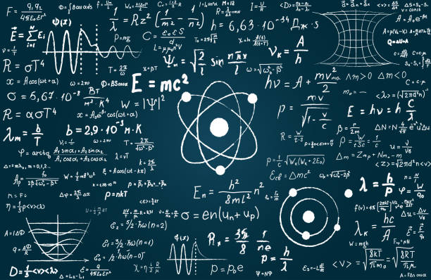

# 👩‍💻 Pietra Valentina

---

> *“Se você acha que entende mecânica quântica, é porque você não entende mecânica quântica.”*  
> — Richard Feynman

---

Olá! Sou a **Pietra Valentina**, desenvolvedora FullStack apaixonada por tecnologia, ciência e pelo universo das infinitas possibilidades do mundo quântico.  
Seja muito bem-vindo(a) ao meu GitHub! 🚀✨

---

## ✨ Sobre Mim

- 👩‍💻 Desenvolvedora **FullStack**
- 🎓 Estudante de **Ciências da Computação**
- 📜 Em processo de escrita de um artigo sobre **Computação Quântica**
- 🛸 Fascinada por física quântica, teoria da informação e aplicações tecnológicas da ciência
- 🤝 Aberta para colaboração em projetos open-source, tecnologia e divulgação científica
- 🌎 Brasil
- 📫 [pietravalentinah@outlook.com](mailto:pietravalentinah@outlook.com)

---

## 🚀 Tecnologias & Ferramentas

---

## 🧠 Física Quântica & Computação

- Em constante estudo sobre **mecânica quântica**, **teoria das cordas** e **computação quântica**
- Artigo em desenvolvimento: *Como a Computação Quântica pode revolucionar a tecnologia da informação*
- Buscando conectar algoritmos, lógica, matemática e física fundamental
- Leituras favoritas: "O Universo Numa Casca de Noz", "O Tecido do Cosmos", "Quantum Computation and Quantum Information"

---

## 📈 GitHub Stats

---

## 💼 Projetos em Destaque

- [**Meu Portfólio**]([https://github.com/PietraValen/pietra-react-replica]) — Site responsivo para mostrar meus trabalhos e habilidades. <a href: (https://pietrahimmelsbacg.vercel.app/)><\a>
- [**Capital Consulta Cep**]([https://github.com/PietraValen/ConsultaCEP](https://capitalconsultacep.vercel.app/)) — Projeto prático para consultas de CEP e consumo de API.
- [**ToDo List com Angular**]() — Lista de tarefas moderna e intuitiva.
- (Veja mais projetos em [meus repositórios](https://github.com/PietraValen?tab=repositories))

---

## 📚 Em Aprendizado

- Next.js e frameworks modernos de front-end/back-end
- Testes automatizados (Jest, Cypress)
- Integração com APIs REST, GraphQL e WebSockets
- Computação quântica aplicada e algoritmos quânticos

---

## 🤝 Vamos Conectar?

- [LinkedIn](https://www.linkedin.com/in/pietravalen)
- [Email](mailto:pietravalentinah@outlook.com)
- Troque ideias sobre tecnologia, física, ciência ou projetos!

---

---

⭐️ *Se gostou do meu trabalho, deixe uma estrela!*
